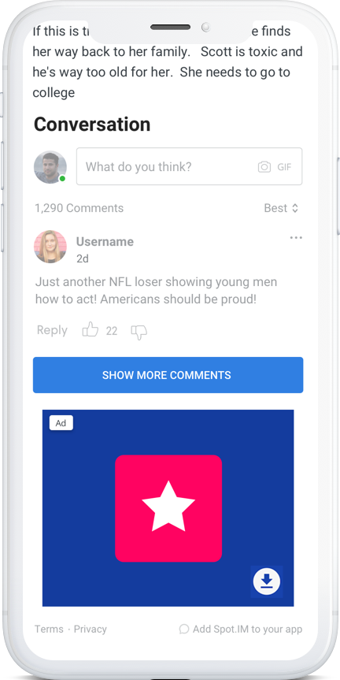
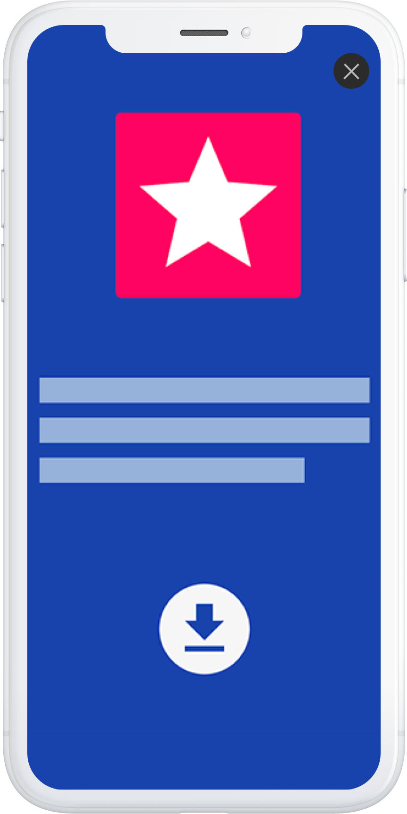
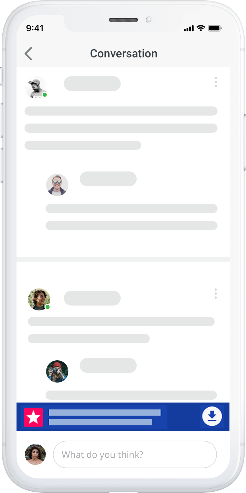

# Spot.IM SDK for iOS 🚀

This library provides an easy integration with Spot.IM into a native iOS app.

## Requirements

* iOS 10.3 or later.
* Have a [Spot.IM](https://spot.im) account

## Getting started

### Add the SDK to your project

#### [CocoaPods](https://cocoapods.org)
1. Set dependency as follows:
    `pod 'SpotIMCore', '0.0.34'`
2. Execute `pod install` in Terminal
3. Open workspace file and run

### Initialize The SDK

Add SpotIm initialization code into your AppDelegate
First import our SDK from the AppDelegate
`import SpotImCore`

To use the SDK you need to set your unique Spot ID when initializing the SDK.
In the `application(application:didFinishLaunchingWithOptions)` call the following method:

##### Example

```swift
    SpotIm.initialize(spotId: YOUR_UNIQUE_SPOT_ID)
```

### Flows

Our SDK exposes one major flow to set up. The pre-conversation view is a view that displays a preview of 2-16 comments from the conversation, a text box to create new comments and a button to see all comments.

The Pre-conversation view should be displayed in your article view controller below the article.

When the user wants to see more comments we push a new ViewController which displays all comments from the conversation.

When clicking on the text box to create a new comments we bring the user to the creation screen. The users needs to be logged in inorder to post new comments, this is where the hosting app needs to integrate it's authentication system.

### Usage

#### Supporting Dark mode theme
SpotIm screen support dark mode theme with a default gray background color. To set the background color to match the parent app you can use the following API

```swift
SpotIm.darkModeBackgroundColor = UIColor.PARENT_APP_DARK_THEME_BACKGROUND_COLOR
```

#### Getting conversation counters
Getting comments and replies counts for conversations

##### Example

```swift
SpotIm.getConversationCounters(conversationIds: [CONVERSATION_ID]) { result in
    switch result {
        case .success(let counters):
            let counter = counter["SPECIFIC_CONVERSATION_ID"]
            print(counter.comments)
            print(counter.replies)
        case .failure(let error):
            print(error)
        @unknown default:
            print("Got unknown response")
    }
}
```

#### Get SpotImSDKFlowCoordinator

End user is supposed to interact with the Pre-Conversation View Controller (PCVC) first. To get and instance of it, you need an instance of `SpotImSDKFlowCoordinator`:
```swift
SpotIm.createSpotImFlowCoordinator(navigationDelegate: self) { result in
    switch result {
        case .success(let coordinator):
            self.spotIMCoordinator = coordinator
        case .failure(let error):
            print(error)
        @unknown default:
            print("Got unknown response")
    }
}
```
Make sure to have a strong reference, it will be deallocated otherwise.

#### Get PreConversationViewController

Then you can instantiate PCVC for specific post (article) ID. PCVC will be passed to the completion block:
```swift
spotIMCoordinator?.preConversationController(
  withPostId: "POST ID",
  articleMetadata: SpotImArticleMetadata(url: URL_TO_THE_ARTICLE_PAGE_ON_THE_WEB, title: ARTICLE_TITLE, subtitle: ARTICLE_SUBTITLE, thumbnailUrl: URL_TO_ARTICLE_THUMBNAIL_IMAGE),
  numberOfPreLoadedMessages: 2, // This is optional, Default = 2, Maximum = 15
  navigationController: navigationController,
  completion: { [weak self] preConversationVC in
    // add preConversationVC to your view controller
  }
)
```

PCVC's view should be added as a subview of a view of another view controller.

##### ⚠️ IMPORTANT

Please make sure to use the same post id you use on your web application so that the SDK would be able to display the same comments from the web application.

#### Adding PreConversationViewController

1. Add PCVC as a child of another VC
2. Add PCVC view to a view of another VC or a container view
3. Layout the PCVC view
4. Call `open func didMove(toParent parent: UIViewController?)` method of PCVC instance

##### Example

```swift
preConversationVC.view.translatesAutoresizingMaskIntoConstraints = false

self.addChild(preConversationVC)
self.containerView.addSubview(preConversationVC.view)

preConversationVC.view.topAnchor.constraint(equalTo: self.containerView.topAnchor).isActive = true
preConversationVC.view.leadingAnchor.constraint(equalTo: self.containerView.leadingAnchor).isActive = true
preConversationVC.view.bottomAnchor.constraint(equalTo: self.containerView.bottomAnchor).isActive = true
preConversationVC.view.trailingAnchor.constraint(equalTo: self.containerView.trailingAnchor).isActive = true

preConversationVC.didMove(toParent: self)
```

#### Listen to PreConversationView size changes
Make sure the container view can be resized when the PreConversationViewController is filled with comments.
To understand when the view gets resized, you can implement `SpotImLayoutDelegate` protocol and get a callback via `viewHeightDidChange(to newValue: CGFloat)` method.
To get the callback please make sure you set your layout delegate into the SpotImSDKFlowCoordinator before trying to load the view.
```swift
spotIMCoordinator.setLayoutDelegate(delegate: YOUR_DELEGATE_IMPLEMENTATION)
```

#### Authentication
To utilize SSO authentication, provide a view controller that can login to your system via `SpotImSDKNavigationDelegate` protocol:
```swift
extension ArticleViewController: SpotImSDKNavigationDelegate {
    func controllerForSSOFlow() -> UIViewController {
        return SOME_LOGIN_VIEW_CONTROLLER
    }
}
```

##### Authentication with SSO:

There are to types of SSO available: **Generic SSO** and **SSO with JWT secret**. Please contact your Spot.IM advisor to pick the best option for you.

##### Generic SSO

1. Authenticate a user with your backend
2. Call `startSSO` function and get `codeA`
3. Send the `codeA` and all needed information to your backend system in order to get `codeB`
4. Call `completeSSO` with the `codeB`
5. Check `success` and `error` properties in the callback to ensure everything is ok

###### Example
```swift
// 1
func login(username: String, password: String) {
    MyAuthenticationProvider.login(
        with: username,
        password: password) { success, error in
            if let error = error {
                handleLoginError()
            } else {
                self.authenticateWithSpotIm()
            }
        }
}
func authenticateWithSpotIm() {
    // 2
    SpotIm.startSSO { [weak self] response, error in
        if let error = error {
            print(error)
        } else {
            self?.getCodeB(codeA: response?.codeA)
        }
    }
}
private func getCodeB(codeA: String?, jwtToken: String?) {
    // 3
    MyAuthenticationProvider.getCodeB(
        with: codeA,
        // Some identification that this user is authenticated to your backend system
        accessTokenNetwork: myUserToken) { [weak self] codeB, error in
            if let error = error {
                print(error)
            } else {
                self.completeSSOWithSpotIm(genericToken: genericToken)
            }
    }
}
private func completeSSOWithSpotIm(codeB: String?, jwtToken: String?) {
    // 4
    SpotIm.completeSSO(with: codeB) { [weak self] success, error in
        // 5
        if let error = error {
            print(error)
        } else if success {
            print(“Authenticated successfully!”)
        } 	
    }
}
```


##### SSO with JWT secret

1. Authenticate a user with your backend
2. Call `sso(withJWTSecret` function with a user JWT secret
3. If there’s no error in the callback and `response?.success` is true, the authentication process finished successfully

###### Example
```swift
func authenticate(withJWTSecret: secret) {
    SpotIm.sso(withJwtSecret: secret, completion: { (response, error) in
        if let error = error {
            print(error)
        } else if let success = response?.success, success {
            print(“Authenticated successfully!”)
        }
    })
}
```

##### Logout
Call SpotIm logout API whenever a user logs out of your system

###### Example
```swift
func logout(withJWTSecret: secret) {
    SpotIm.logout(completion: { result in
      switch result {
          case .success():
              print("Logout from SpotIm was successful")
          case .failure(let error):
              print(error)
          @unknown default:
              print("Got unknown response")
      }
    })
}
```

##### Login status
An API to understand the status of the current SpotIm user.
Guest - Means this is a guest unregistered user. You should call startSSO/sooWithJWT if your own login status is 'user is logged in'
LoggedIn - Mean this is a registered user of SpotIm. You should avoid calling startSSO/sooWithJWT in this case. If you own status is 'user is logged out', you should SpotIm logout method

###### Example
```swift
func authenticate(withJWTSecret: secret) {
    SpotIm.getUserLoginStatus(completion: { result in
      switch result {
          case .success(let loginStatus):
              print("User is \(loginStatus)")
          case .failure(let error):
              print(error)
          @unknown default:
              print("Got unknown response")
      }
    })
}
```

## SDK Monetization
The SDK supports 2 types of ad formats:
* Banner - 320X50
* Interstitial - full page

### Ads Placements
#### Article page - Banner below the conversation


#### Interstitial - Display ad or video will be shown when navigating to the conversation page only once per article


#### Conversation page


Note about ads: Ads are currently being A/B tested. The ads will be shown to certain users according to an A/B test. The next step will be testing more ad formats to optimize both experience and revenue.

### Implementation instructions
In order to see ads in your app using our SDK, there are a few steps:

1. When filled the GAM (Google Ad Manager) form should indicate apps. Once the form is approved (check with your PSM) ads will be eligible to appear.
When GAM (Google Ad Manager) form is approved (check with your PSM) ads will be eligible to appear.
2. The app-ads.txt needs to be implemented in the web environment:  (www.your-domain.com/app-ads.txt)
Click here for implementation guidelines.
3. Our monetization team will create a campaign for native app ads.
4. Lets make some money!

## Troubleshooting

##### Cocoapods installaion fails with error
```
[!] Unable to find a specification for `SpotIMCore...
```
##### Solution
run `pod repo update` in the terminal to refresh your local spec repos before installation.

##### Pod search fails with error
```
[!] Unable to find a pod with name, author, summary, or description matching `SpotIMCore`
```
##### Solution
CocoaPods search index has some known bugs. Just proceed with usual installation.
